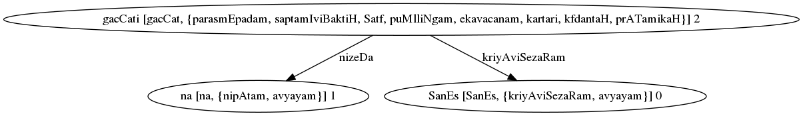
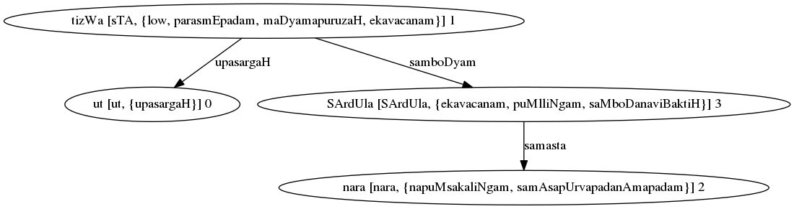

Documentation
=========================================

Introduction
------------

The goal of the `sanskrit_parser` project is to create a freely reusable open
source sanskrit parser and generator. This is intended to be usable as a
python library for other tools that need sanskrit parsing and generation, as
well as providing basic command line and web user interfaces for basic tasks.

We aim to be

* Freely reusable (the more the merrier)
* Open Source
* Classical - We favour traditional grammar over statistical methods,
   but use statistical methods where necessary and helpful.

Sandhi Split / Segmentation
---------------------------

Given a phrase, the goal is to be able to generate all valid
segmentations (sandhi splits) such that each segment is a valid
Sanskrit word (pada).

For this, we first need a pada dictionary. We currently use a
combination of open source data from the sanskrit_data_ project and
the `Sanskrit Heritage project of INRIA`_. 

.. _sanskrit_data: https://github.com/avinashvarna/sanskrit_forms
.. _`Sanskrit Heritage project of INRIA`:  https://gitlab.inria.fr/huet/Heritage_Resources

This will be eventually replaced by our own Paninian Pada generator when that
is complete.

Sandhi Rules
............

Paninian Sandhi rules have been implemented as a set of matching rules
which define how sandhi transformations work.

For example the famous इको यणचि (६.१.७७) rule is implemented thus ::
  
 # यण्-सन्धिः
 # इको यणचि (६.१.७७)
 [*हल्][इ, ई] + [*अच् - इई][*हल्+ं] = {0}य्{2}{3}
 [*हल्][उ, ऊ] + [*अच् - उऊ][*हल्+ं] = {0}व्{2}{3}
 [*हल्][ऋ, ॠ] + [*अच् -ऋॠऌ][*हल्+ं] = {0}र्{2}{3}
 [*हल्][ऌ]+ [*अच् -ऋॠऌ][*हल्+ं] = {0}ल्{2}{3}

Since these rules are defined in terms of Paninian pratyaharas such as
``[*हल्]``, these are internally expanded into multiple sub-rules. Each
subrule will end up with a defined sequence of characters on its right
hand side.

If a substring match with exactly that sequence is found,
then the left hand side of the same subrule, suitably extended by the
substring prefix and suffix is output as a possible split.

At this stage, have a valid split as per sandhi rules, but not
necessarily valid words in both halves. This is handled by the next stage.

Algorithm for Sandhi Split
..........................

We use a dynamic programming (memoized) algorithm to determine all possible
**valid** sandhi splits for a string.

#. Given a string, we scan it from left to right, and generate a list of all possible splits at each point (as defined in the previous section) as determined by our library of sandhi rules.
#. If the left hand split is a valid sanskrit word, we recursively split the right hand split using the same algorithm.
   
   #. This split is memoized as is expected in a dynamic programming algorithm
#. The result of this algorithm is a DAG (Directed Acyclic Graph) that represents all sandhi splits of the input string into valid words. *Each split does not need to correspond to a valid sentence (vAkya) at this stage. That constraint is handled by the next stage*.

For example, the string "अहङ्गच्छामि" results in the following DAG

.. image:: static/aham_gacCAmi.png

All graphs in this document have Sanskrit text encoded in SLP1_ format except if otherwise stated

.. _SLP1: https://en.wikipedia.org/wiki/SLP1

From this graph, each path between the beginning and the end nodes is a valid segmentation. When enumerating segmentations, we have two options

#. Prioritize paths with fewer number of words
#. Prioritize paths with a lower score (default). This uses a word2vec based scoring approach

Vakya Analysis / Dependency Parsing
-----------------------------------

The task of Vakya Analysis (Dependency Parsing) is to interpret a
sandhi split (segmentation) as a valid Sanskrit sentence if
possible. Each possible morpholgical interpretation of a word is
considered, and valid sentence interpretations are output. 

Algorithm for Vakya Analysis
.............................

Given a sandhi split of the input phrase into valid words, we

#. Determine all valid morphologies of each pada. For example, रामः could be the प्रथमा एकवचनम् form of राम, or the लट् उत्तमपुरुषबहुवचनम् form of the verb रा. Only dependency parsing will tell us which form is relevant to the current sentence.
#. The Sandhi Graph from the previous stage is transformed into a Vakya Graph, which is a k-partite graph with each partition containing the possible morphologies of each word. For example, the input रामो लङ्कां याति, which is split as रामः लङ्काम् याति results in this: :ref:`kpgraph`
#. Edges are added between nodes in different partitions, so that each edge describes a possible grammatical relationship.
#. A modified version of Kruskal's algorithm is used to extract all Generalized Spanning Trees (GST) of the k-partite Vakya Graph. A GST is defined as a tree that contains exactly one node of each partition in the k-partite Vakya Graph.

#. A Constraint checker checks consistency of each GST against a set of rules.
#. Each such GST will be a valid parse of the sentence. For example: :ref:`parsegraph`

Graphs
+++++++

Some sample k-partite VakyaGraph and parse graphs generated

.. _kpgraph:

.. figure:: static/rama_split0.dot.png
   :width: 800
	      
   k-partite graph for रामः लङ्काम् याति

.. _parsegraph:

.. figure:: static/rama_split0_parse0.dot.png
   :width: 800

   Parse Graph for रामः लङ्काम् याति

.. _parsegraph3:

.. figure:: static/ds_split0_parse0.dot.png
   :width: 800

   Parse Graph for "धर्मक्षेत्रे कुरुक्षेत्रे समावेता युयुत्सवः किमकुर्वत"

Edges
......

We add the following set of edges

**Karaka Edges**

These edges are added between verb forms and others based on vibhakti
(note that these names are SLP1 encoded)

#. kartA
#. hetu-kartA
#. karma
#. gauRa-karma
#. karaRam
#. saMpradAnam
#. apAdAnam
#. aDikaraRam
#. samboDyam

.. _parsegraph_karaka:

.. figure:: static/karaka_split0_parse0.dot.png
   :width: 800

   Parse Graph for "राघवः रावणम् बाणैः रणभूमौ जघान"

.. _parsegraph_karaka2:

.. figure:: static/pustakam_split0_parse20.dot.png
   :width: 800

   Parse Graph for "अहम् तस्मै पुस्तकम् अददम्"

.. _parsegraph_gauna:

.. figure:: static/gauna_split0_parse0.dot.png
   :width: 800

   Parse Graph for "गां दोग्धि पयः"

   
**Non-kAraka Vibhakti-based Edges**

#. zazWI-sambanDa
#. upapada-dvitIyA
#. upapada-tftIyA
#. upapada-caturTI
#. upapada-pancamI
#. viSezaRam

**Non-Vibhakti-Based Verb Edges**

#. kriyAviSezaRam
#. upasargaH (verbal prefixes)
#. karmapravacanIyaH
#. BAvalakzaRam
#. nizeDa
#. pUrvakAlaH
#. samAnakAlaH
#. prayojanam

.. _parsegraph_bana:

.. figure:: static/bana_split0_parse1.dot.png
   :width: 800

   Parse Graph for "रामः रावणस्य शिरांसि प्रति तीक्ष्णान् बाणान् चिक्षेप"

.. _parsegraph_bhava:

.. figure:: static/bhavalakshanam_split0_parse5.dot.png
   :width: 800

   Parse Graph for "गोषु दुह्यमानासु अगच्छत्"

.. _parsegraph_nishedha:

   Parse Graph for "शनैः न गच्छति"

.. _parsegraph_upasarga:

   Parse Graph for "उत्तिष्ठ नरशार्दूल"

   

.. _parsegraph_rnam:

.. figure:: static/rnam_split0_parse9.dot.png
   :width: 800

   Parse Graph for "ऋणम् कृत्वा घृतम् पिबेत्"

**Other Non-Vibhakti Edges**

#. vIpsA (repeated words)
#. samasta (for samAsa constituents except the last)
   
**Conjunctions**

#. samuccitam

.. _parsegraph_arjuna:

.. figure:: static/arjuna_split0_parse0.dot.png
   :width: 800

   Parse Graph for "अर्जुनः कर्णम् जरासन्धम् च जघान"

   
**Sentence Conjunctions**

#. vAkyasambanDaH (from yat to tat, for example)
#. sambaDakriyA   (in the absence of tat, from yat to the dependent verb)
#. sambadDa-kartA etc. (where a kAraka for a main and dependent verb are paired, the dependent verb's kAraka arc is reversed with a sambaDa arc)

   
.. _parsegraph_vidya:

.. figure:: static/vidya_split0_parse0.dot.png
   :width: 800

   Parse Graph for "सा विद्या वर्तते या मुक्तिम् ददाति"

   

Modified Kruskal Algorithm
--------------------------

Several algorithms are available to compute Spanning Trees (ST), and specifically Minimum Cost Spanning Trees (MST) for connected graphs.
Our VakyaGraphs are k-partite, and we need to fint a GST rather than an ST. We extend one of the standard algorithms - `Kruskal's Algorithm <https://en.wikipedia.org/wiki/Kruskal%27s_algorithm>`_ - to:

* Work with k-partite graphs
* Generate all GSTs instead of only a MST.

Our implementation of the Modified Kruskal Algorithm works thus:

#. We start with a k-partite Vakya Graph
#. Our main datastructure is called a VakyaParse. Each VakyaParse data structure incorporates

   #. A `DisjointSet data-structure <https://en.wikipedia.org/wiki/Disjoint-set_data_structure>`_ similar to Kruskal's Algorithm
   #. A set of edges in the parse
   #. A set of active nodes in the partial parse (which is identical to the nodes in the set of edges) but maintained separately to limit computation
   #. A set of extinguished nodes: all nodes that are in the same partitions as the active nodes, and hence cannot be part of the parse.
#. We initialize the set of candidate parses with a VakyaParse initialized to a null partial parse. A VakyaParse is called a partial parse while this algorithm is running, a candidate parse before Final Constraint Check, and a parse afterwards.
#. We iterate over each partition. At each partition, all input edges to any node in the partition are examined. If an edge is safe to add to a partial parse, a *new* partial parse is created by adding that edge, and the new partial parse is added to the set of partial parses. When an edge is added to a partial parse, all nodes in the same partitions as the two nodes of the edge are moved to the extinguised list of that partial parse.  An edge is safe to add to a partial parse when

      #. Neither node of the edge is in the partial parse's extinguished list
      #. Adding the edge will not cause a loop
      #. Adding the edge will not violate `On-The-Fly Constraints`_
	 
#. Note that the current set of partial parses are retained in the partial parse set, the extensions in the previous step are added to the set. This is because a GMST with `n` nodes will have only `n-1` edges, and hence we need to account for the possibility of a partial parse being unmodified in one iteration. 
#. Once we have added all possible edges to all possible partial parses and extended the partial parse set, we prune "small parses". As indicated, we expect a GMST to have `n-1` edges. A small parse is one with less than `m-1` edges, where `m` is the number of iterations so far. We know that these cannot result in a parse with `n-1` edges, given that there are only `n-m` iterations left.
#. Once all partitions have been seen, the set of partial parses is now our set of candidate parses
#. All candidate parses are taken through checks of `Final Constraints`_, and all that pass become our list of valid parses.
   
Divide and Conquer
..................

To control runtime, we use the divide-and-conquer approach. We maintain a maximum number of partitions, below which the algorithm divides the partition set into two. Once partial parses for each subset is created as above, a cross-product merge of the sets of partial parses is performed. Merging two partial parses is conceptually equal to adding all edges in a partial parse to another after performing the requisite checks of `On-The-Fly Constraints`_. However, this can be accelerated using set operations on the edge, active and extinguished sets. 

GST Constraint Checks
----------------------

Not all outputs of a tree-finding algorithm are valid parse
graphs. Therefore, two sets of constraints are applied in the process
to reject incorrect parses. These incorporate grammatical knowledge
about what constitutes a valid parse.

Constraints are applied in two stages

#. On the fly, when partial parses are being assembled
#. Once a full candidate parse has been assembed

On-The-Fly Constraints
......................

We refer to constraints checked during parse assembly as On-The-Fly
Constraints. Any constraint that is fully applicable to any subset of
a valid parse falls in this category.

Obvious examples are

#. No loops are allowed
#. There can be only one node that satisfies a particular kAraka relation with a verb form
#. A word can perform only one grammatical function - that is to say, it can have only a single incoming node (strictly speaking, this is not applied as a constraint, but baked into the sequence of edge picking in the algorithm)
   #. For reversed edges (sambadDa-kartA, etc.), there can be only one such edge going *out* of a node. 
#. A viSezaRa cannot have another viSezaRa.
      
These are checked before any partial parse is added to the list of current partial parses is the algorithm. 

   
Final Constraints
..................

As opposed to an On-The-Fly constraint, a final constraint requires a
full candidate parse, and hence can be checked only when a candidate
parse is fully assembled.

#. Sannidhi check: A GST must be projective to be a valid graph - that is to say, most kinds of edges may not cross each other when the nodes in a graph are laid out linearly, and all edges are marked to one side of the nodes.

   * This excludes viSezaRa edges and zazWI-sambanDa edges (we currently do not allow the latter to cross either)
#. Every conjunction must have exactly one from and to edge.
#. Sentence conjunction checks

   #. We do not allow edges "across" from either of a pair of nodes that form a sentence conjuntion to a node "beyond" the other.
   #. A reversed ("sambadDa-") edge must be from a node with a sentence conjunction relationship (ie: must have a vAkyasambanDa edge coming in)

A candidate parse that satisfies final constraints is considered a valid parse and is output.

Output Formats
--------------

#. :Text: Standard output is provided in human readable text form
#. :Dot: The dot format for graphs is supported (using the `--dot-file` option). This can be further converted into png or other image formats using the `graphviz` framework. Graphs shown in this document have been created in this manner.
#. :Conll: CONLL format is used by the NLP research community, and is provided as an output option mainly for interoperability and test purposes. 
